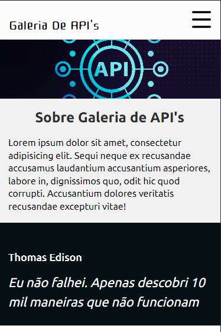

# Galeria de API's

## Descrição
Este projeto nasceu como uma vontade de treinar e aprender a integrar API's utilizando JavaScript.
Dado isso, foi selecionado um pequeno grupo de API's públicas para que os usuários consigam acessar
os resultados delas de forma facilitada.
Ou seja, sem a necessidade de saber programar, somente preenchendo um formulário, qualquer pessoa consegue, por exemplo, utilizar a API APOD da NASA, ou a API geradora de conselhos ou, até mesmo, uma API geradora de códigos QR Code.

## Como usar
A página inicial contém uma breve descrição de para que serve o site. Contém um menu lateral onde o usuário pode navegar pelas API's que se deseja conhecer. Ou também pode simplesmente observar os cards que contém uma breve descrição de cada uma.
Após selecionar a API desejada, o usuário será redirecionado para uma nova aba na qual será apresentado aos parâmetros necessários para o bom funcionamento da API junto com boas práticas (quando elas existem) para uma melhor experiência.
Assim, ciente de como ela funciona, ele pode simplesmente preencher os campos pedidos e executar a API, tendo os resultados logo abaixo do mesmo formulário.
Assim, de forma simples eu consigo, por exemplo, pesquisar uma lista de significados, sinônimos, antônimos e exemplos de uso de qualquer palavra da língua inglesa com a API de dicionário.

## Contato

## Deploy
1. [Vercel](https://colecao-de-api.vercel.app/)